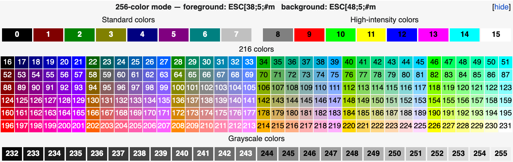

# Dotfiles

## Structure


## Appearance


You can edit prompt settings in `zsh/settings/prompt.sh`.
To change the color of the prompt, you need to edit the number in `%F{46}...%f`. The number is the color code. Check the image below.

table from [here](https://en.wikipedia.org/wiki/ANSI_escape_code#8-bit)

To change the color of file or directory names, you need to edit `export LS_COLORS=...` in `zsh/.zshenv`. Refer to the following links.
- [SGR (Select Graphic Rendition) parameters](https://en.wikipedia.org/wiki/ANSI_escape_code#SGR_(Select_Graphic_Rendition)_parameters)
- [How to Change Colors on LS in Bash](https://linuxhint.com/ls_colors_bash/)


## Zsh settings
- Set zsh as your login shell:
    ```zsh
    chsh -s $(which zsh)
    ```

- In `.zshenv`, set `zsh/` as `ZDOTDIR`.
    ```zsh
    export ZDOTDIR="$HOME/path/to/dotfiles/zsh"
    ```

- And make the alias of `.zshenv` in your home directory.
    ```zsh
    ln -s ~/path/to/dotfiles/zsh/.zshenv ~/.zshenv
    ```

- Install `zsh` plugins.
    ```zsh
    brew install zsh-autosuggestions
    brew install zsh-completions
    brew install zsh-git-prompt
    ```

## Other Homebrew packages
- Install `coreutils`, `gh` and `tree`.

    ```zsh
    brew install coreutils
    brew install gh
    brew install tree
    ```

---
The details of my `zsh/` are described in [Zsh](https://kkensuke.github.io/myjb/pages/basic/zsh.html) and [Alias](https://kkensuke.github.io/myjb/pages/basic/alias.html).
