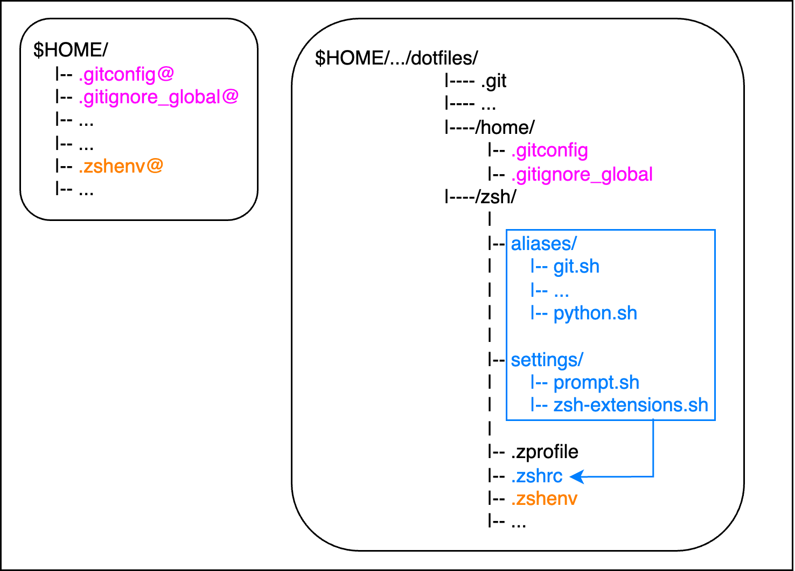

# Dotfiles



In `.zshenv`, set `zsh/` as `ZDOTDIR`.
```zsh
export ZDOTDIR="$HOME/path/to/zsh"
```

And make the alias of `.zshenv` in the home directory.

```zsh
ln -s ~/path/to/zsh/.zshenv ~/.zshenv
```

The details of my `zsh/` settings are described in [Zsh](https://kkensuke.github.io/myjb/pages/basic/zsh.html) and [Alias](https://kkensuke.github.io/myjb/pages/basic/alias.html).
