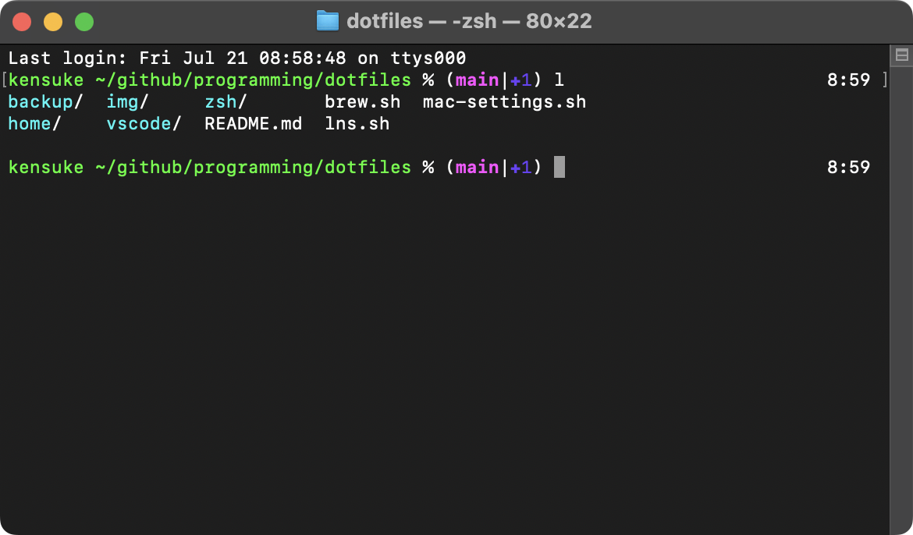

# Dotfiles

## Appearance



## Structure


## Zsh settings
- Set zsh as your login shell:
    ```bash
    chsh -s $(which zsh)
    ```

- In `.zshenv`, set `zsh/` as `ZDOTDIR`.
    ```zsh
    export ZDOTDIR="$HOME/path/to/dotfiles/zsh"
    ```

- And make the alias of `.zshenv` in your home directory.
    ```zsh
    ln -s ~/path/to/dotfiles/zsh/.zshenv ~/.zshenv
    ```

- Install `zsh` plugins.
    ```zsh
    brew install zsh-autosuggestions
    brew install zsh-completions
    brew install zsh-git-prompt
    ```

## Other Homebrew packages
- Install `coreutils`, `gh` and `tree`.
    ```bash
    brew install coreutils
    brew install gh
    brew install tree
    ```

---
The details of my `zsh/` are described in [Zsh](https://kkensuke.github.io/myjb/pages/basic/zsh.html) and [Alias](https://kkensuke.github.io/myjb/pages/basic/alias.html).
