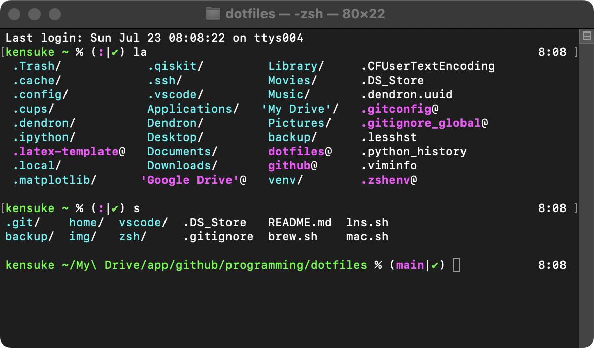
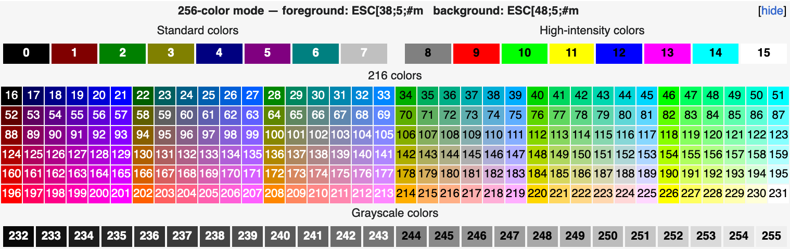

# Appearance

You can edit prompt settings in `zsh/settings/prompt.sh`.
To change the color of the prompt, you need to edit the number in `%F{46}...%f`. The number is the color code. Check the image below.

table from [here](https://en.wikipedia.org/wiki/ANSI_escape_code#8-bit)

To change the color of file and directory names as outputs, you need to edit `export LS_COLORS=...` in `zsh/.zshenv`. Refer to the following links.
- [SGR (Select Graphic Rendition) parameters](https://en.wikipedia.org/wiki/ANSI_escape_code#SGR_(Select_Graphic_Rendition)_parameters)
- [How to Change Colors on LS in Bash](https://linuxhint.com/ls_colors_bash/)